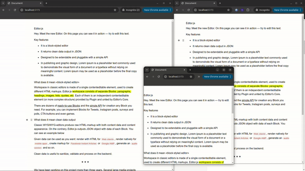

# Realtime WYSIWYG Editor With Responsive Caret Selection

An EditorJS instance with Realtime block changes and Responsive Caret Selection with Express.js and Socket.Io. This is the repository for [the Medium article](https://medium.com/@thomasbrillion/build-your-own-collaborative-realtime-notion-11c361fb2cbe).  



## Clone this repository

```bash
git clone https://github.com/w99910/realtime-editor.git && cd realtime-editor
```

## Install Dependencies

```bash
 npm install
```

## Run Socket IO server

```bash
node server.cjs
```

## Run application

```bash
npm run dev
```

## Access the application

You can access the application at [http://localhost:5173](http://localhost:5173).